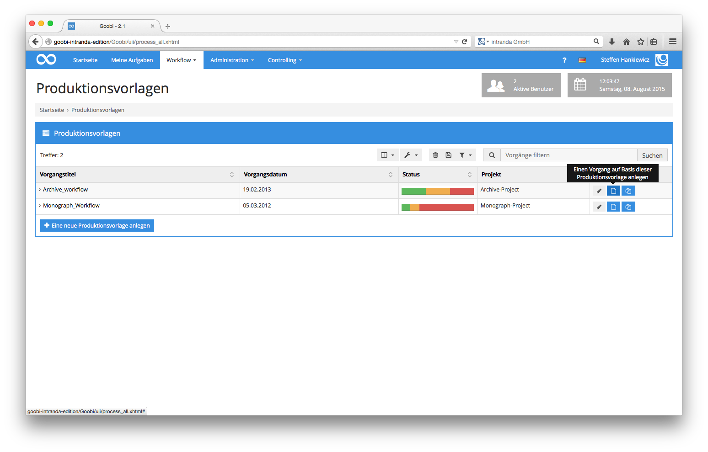
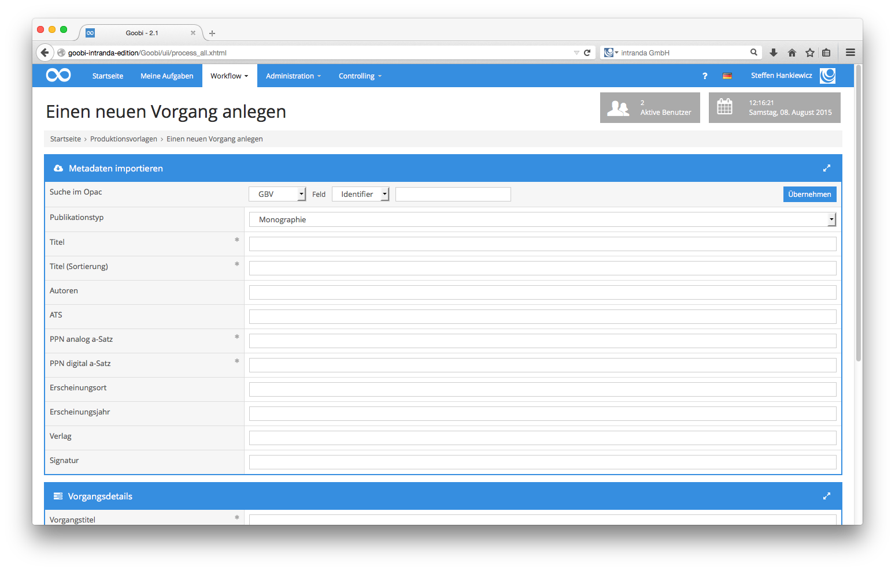
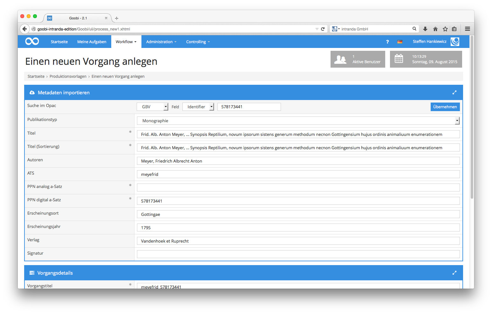
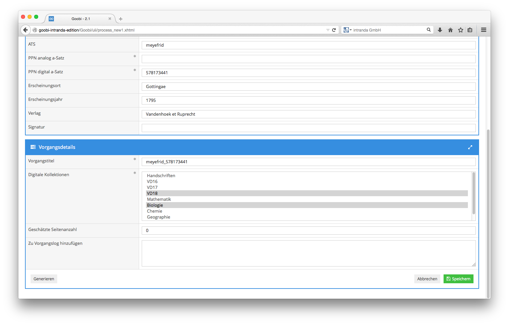
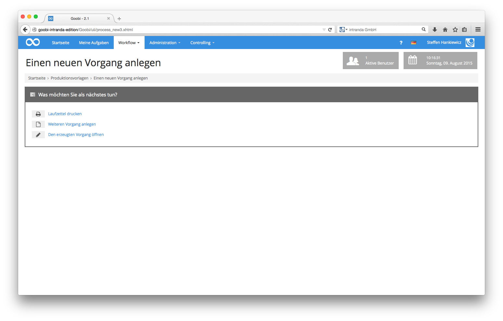
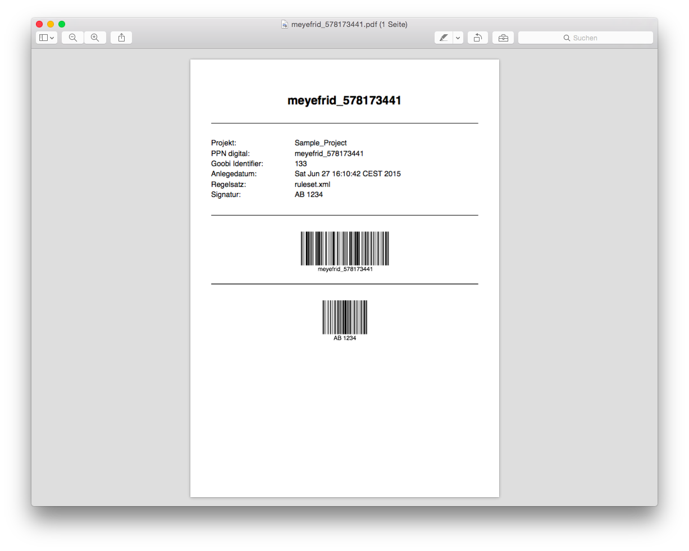

# 4.1.11. Anlegen von Vorgängen

Um neue Vorgänge in den Datenbestand von Goobi aufzunehmen, bietet Goobi Ihnen eine besondere Oberfläche. Zu dieser gelangen Sie, indem Sie in der Menüleiste auf den Menüpunkt `Workflow - Produktionsvorlagen` klicken. Anschließend erhalten Sie eine Auflistung, die sämtliche bereits in Goobi vorhandenen Produktionsvorlagen mit ihren konfigurierten Workflows enthält.

In dieser Auflistung erhalten Sie einen Überblick über sämtliche Produktionsvorlagen, für die Sie als Projektmitglied in Goobi berechtigt sind. Die Auflistung dieser Vorlagen unterscheidet sich lediglich in der Spalte `Aktionen` von der Auflistung der Vorgänge. Um einen neuen Vorgang in Goobi hinzuzufügen, klicken Sie in der Spalte `Aktionen` auf das entsprechende Symbol.

|  | Einen Vorgang auf Basis dieser Produktionsvorlage anlegen. |
| :--- | :--- |

Es öffnet sich somit eine neue Maske zur Erfassung der bibliographischen Daten für den anzulegenden Vorgang.

In diesem Handbuch soll auf die am meisten verbreitete Weise eingegangen werden, wie Vorgänge in Goobi mittels der Übernahme von Metadaten aus einem Bibliothekskatalog angelegt werden. Weitere Informationen oder alternative Wege, um einen oder mehrere Vorgänge gleichzeitig in Goobi anlegen zu lassen, werden in dem [Abschnitt Goobi Management](../../5/) beschrieben.  
Zur Übernahme von bibliographischen Daten aus einem der konfigurierten Bibliothekskataloge \(Pica, Aleph, Z39.50 etc.\) wählen Sie den gewünschten Katalog in der Auswahlliste `Suche im OPAC` aus und tragen dahinter den entsprechenden Identifier ein. Nach der Eingabe des Identifiers klicken Sie auf die zugehörige Schaltfläche `Übernehmen`. Anschließend sehen Sie, wie die vorhandenen Felder automatisch durch Goobi ausgefüllt wurden und der Publikationstyp korrekt eingestellt ist.

Füllen Sie im Anschluss an die Kataloganfrage nun all diejenigen Felder aus, die mit einem Stern hinter den Bezeichnern gekennzeichnet sind. Diese Felder sind Pflichtangaben. Alle anderen Felder können natürlich ebenfalls ergänzt werden. Die Felder für den Autor-Titel-Schlüssel \(ATS\) bzw. den Titel-Schlüssel \(TSL\) sollten Sie nicht manuell erfassen. Die Felder für Vorgangstitel, Tif-Header Documentname, Tif-Header Image-Beschreibung sowie der Autor-Titel-Schlüssel bzw. der Titel-Schlüssel werden automatisch durch Goobi beim Speichern ausgefüllt, bzw. wenn Sie die Schaltfläche `Generieren` klicken. Der Autor-Titel Schlüssel ist eine Kombination aus einigen Zeichen des Haupttitels sowie der beteiligten Personen. Der Vorgangstitel wird aus dem generierten Autor-Titel-Schlüssel sowie einem eindeutigem Identifier gebildet. Auf diese Weise sind in Goobi sämtliche Vorgangstitel mit eindeutigen, aber zugleich sprechenden Namen versehen.

Bevor Sie nun auf die Schaltfläche `Speichern` klicken, stellen Sie bitte sicher, dass mindestens eine digitale Kollektion für diesen Vorgang ausgewählt ist. Durch das Halten der Strg-Taste auf Ihrer Tastatur sind auch mehrere digitale Kollektionen auswählbar. Ein Klick auf `Speichern` führt Sie auf die nächste Seite.

Sie gelangen somit automatisch auf eine Übersichtseite, in der Sie nun die Möglichkeit haben, mit diesem neu erzeugten Vorgang zu arbeiten. So lässt sich beispielsweise zu dem neu erzeugten Vorgang ein Laufzettel generieren. Klicken Sie dafür einfach auf den Link `Laufzettel drucken`. Möchten Sie einen weiteren Vorgang anlegen, klicken Sie auf `Weiteren Vorgang anlegen`. Möchten Sie hingegen den neu erzeugten Vorgang öffnen, um seinen individuellen Workflow oder die Einstellungen zu diesem Vorgang zu ändern, klicken Sie auf `Den erzeugten Vorgang öffnen`.

Nach dem Anlegen eines neuen Vorgangs wird dieser automatisch mit seinem ersten offenen Arbeitsschritt bei all denjenigen Benutzern und Benutzergruppen aufgelistet, die für diesen Arbeitsschritt konfiguriert wurden. Ist der erste Arbeitsschritt innerhalb des Workflows beispielsweise das `Scannen des Werkes`, so wird dieser neu erzeugte Vorgang bei sämtlichen Scanoperateuren aufgelistet, die in diesem Projekt Mitglied sind, aus dem dieser Vorgang stammt, und kann entsprechend durch jeden der zugewiesenen Scanoperateure für die Bearbeitung übernommen werden.

