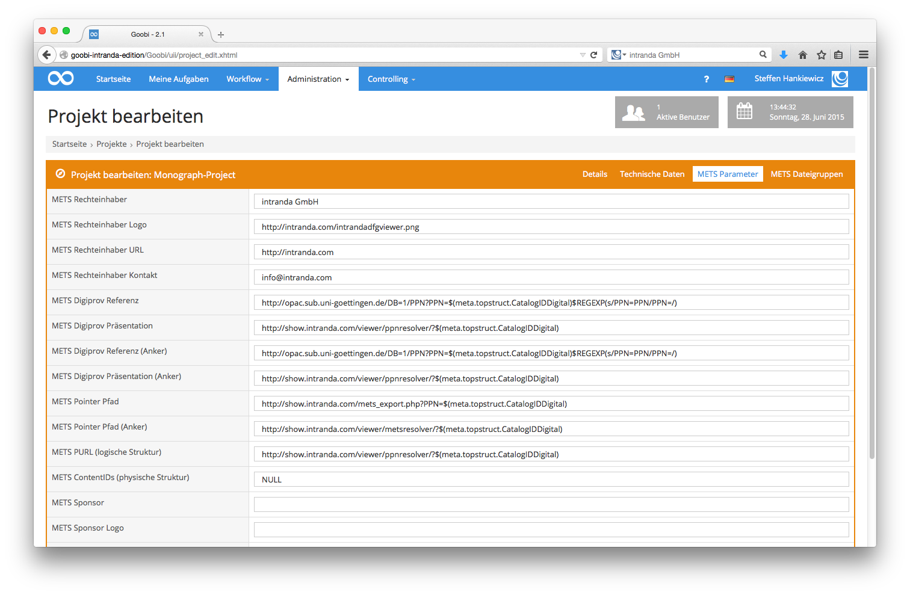
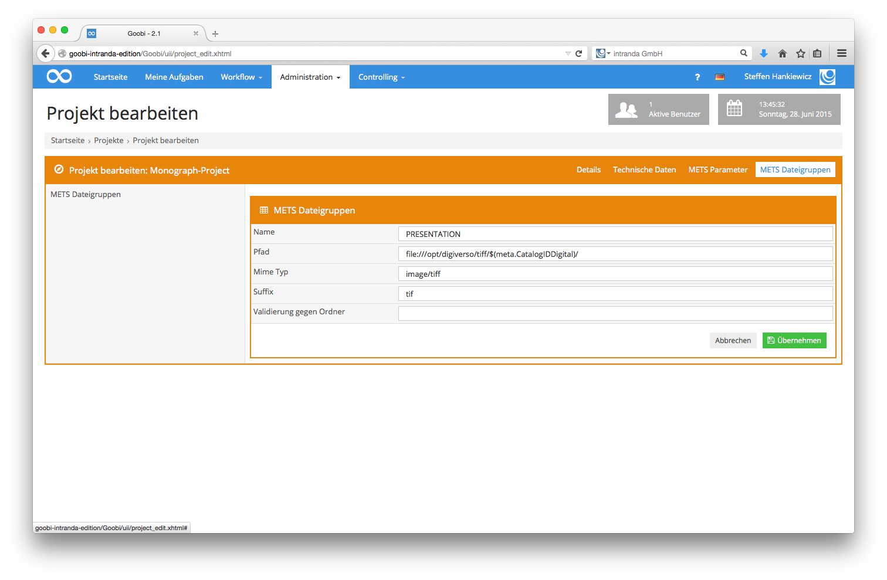

# 6.3.2. Mets Parameter

Die folgende Abbildung zeigt den Reiter `Mets-Parameter` aus den Goobi Projekteinstellungen:

Die hier aufgezeigten Konfigurationseinstellungen bedeuten das folgende:

_**Auflistung der METS-Parameter für die Projektkonfiguration**_

| **Name**  | **Beispielwert**  | **Bedeutung**  |
| :--- | :--- | :--- |
| METS Rechteinhaber | Example Library  | Definiert den METS Rechteinhaber.   |
| METS Rechteinhaber Logo | [http://www.example.net/mylogo.png](http://www.example.net/mylogo.png) | Definiert eine URL für ein Logo des METS Rechteinhabers.   |
| METS Rechteinhaber URL | [http://www.example.net](http://www.example.net) | Definiert eine URL für den METS Rechteinhaber.   |
| METS Rechteinhaber Kontakt | digitisation@example.net  | Definiert eine Kontakt E-Mailadresse für den METS Rechteinhaber.  |
| METS Digiprov Referenz | METS Digiprov Referenz | Definiert einen Link zu dem Katalogeintrag des Werkes.  |
| METS Digiprov Präsentation | [http://presentation.example.net/ppnresolver? id=$\(meta.CatalogIDDigital\)](http://presentation.example.net/ppnresolver?id=$%28meta.CatalogIDDigital%29)  | Definiert einen persistenten Link zu dem Werk in der digitalen Bibliothek.  |
| METS Digiprov Referenz \(Anker\) | [http://catalog.example.net/A? function=search& request=$\(meta.topstruct.CatalogIDDigital\) $REGEXP\(s/PPN=PPN/PPN=/\)](http://catalog.example.net/A?function=search&request=$%28meta.topstruct.CatalogIDDigital%29$REGEXP%28s/PPN=PPN/PPN=/%29)  | Definiert einen Link zu dem Katalogeintrag des übergeordneten Werkes, wenn es sich bei dem exportierten Werk um ein Mehrbändiges Werk handelt.  |
| METS Digiprov Präsentation \(Anker\) | [http://presentation.example.net/ppnresolver? id=$\(meta.topstruct.CatalogIDDigital\)](http://presentation.example.net/ppnresolver?id=$%28meta.topstruct.CatalogIDDigital%29)  | Definiert einen Link zu dem übergeordneten Werk in der digitalen Bibliothek, wenn es sich bei dem exportierten Werk um ein Mehrbändiges Werk handelt.  |
| METS Pointer Pfad | [http://presentation.example.net/metsresolver? id=$\(meta.CatalogIDDigital\)](http://presentation.example.net/metsresolver?id=$%28meta.CatalogIDDigital%29) |  Definiert einen Link zu einem METS-Resolver für das Werk, über den die METS Datei später heruntergeladen werden kann.  |
| METS Pointer Pfad \(Anker\) | [http://presentation.example.net/metsresolver? id=$\(meta.topstruct.CatalogIDDigital\)](http://presentation.example.net/metsresolver?id=$%28meta.topstruct.CatalogIDDigital%29) |  Definiert einen Link zu einem METS-Resolver für das übergeordnete Werk, wenn es sich bei dem exportierten Werk um ein Mehrbändiges Werk handelt, über den die METS Datei später heruntergeladen werden kann. |
| METS Sponsor | Deutsche Forschungsgemeinschaft | Enthält den Namen des Geldgebers der Digitalisierung, beispielsweise die Deutsche Forschungsgemeinschaft.  |
| METS Sponsor Logo | [https://pbs.twimg.com/profile\_images/ 2269029699/5qf8y4k106b1gvpixq40\_ 400x400.jpeg](https://pbs.twimg.com/profile_images/2269029699/5qf8y4k106b1gvpixq40_400x400.jpeg) | Enthält eine URL zu einem Logo des Geldgebers, der die Digitalisierung gefördert hat. Das Logo wird in das Design des DFG-Viewers integriert und ersetzt dort das Logo der Deutschen Forschungsgemeinschaft |
| METS Sponsor URL | [http://intranda.com](http://intranda.com) | Enthält die URL der Homepage des Geldgebers. Die URL wird im DFG-Viewer mit dem Logo des Geldgebers verknüpft.  |
| METS Lizenz | CC-BY | Enthält Angaben zur Lizenz, unter der das Digitalisat veröffentlicht wurde. |

Diese Informationen zum `METS Rechteinhaber`, `METS Rechteinhaber Logo`, `METS Rechteinhaber URL` und `METS Rechteinhaber Kontakt` finden sich in der exportierten METS-Datei in der Sektion `amdSec` im Namespace `dv` wieder und dienen der Kompatibilität mit dem `DFG-Viewer`.

Innerhalb der Beispielwerte gibt es drei Variablen, die wie folgt erklärt sind

* `$(meta.CatalogIDDigital)` wird beim Export durch die CatalogIDDigital des Werkes aus der METS-Datei ersetzt.
* `$(meta.topstruct.CatalogIDDigital)` wird beim Export durch die CatalogIDDigital des Mehrbändigen Werkes aus der METS-Datei ersetzt.
* `$REGEXP(s/PPN=PPN/PPN=/)` wendet den definierten regulären Ausdruck auf die gesamte Zeile an. In diesem Fall wird PPN=PPN gesucht und durch PPN= ersetzt.

Neben den aufgeführten Konfigurationsparametern lassen sich darüber hinaus auch die METS-Dateigruppen festlegen. Die Abbildung zeigt fünf definierte Dateigruppen:

* Min
* Max
* Thumbs
* Default
* Presentation

Die Dateigruppen `Min`, `Max`, `Thumbs` und `Default` dienen zur Kompatibilität mit dem `DFG-Viewer`.

In der nachfolgenden Abbildung ist der Konfigurationsdialog für die Konfiguration dieser METS-Dateigruppen ersichtlich:

Die hier bereitgestellten Konfigurationseinstellungen bedeuten folgendes:

_**Erläuterung aller Parameter zur Steuerung der METS-Dateigruppen-Generierung**_

<table>
  <thead>
    <tr>
      <th style="text-align:left"><b>Name </b>
      </th>
      <th style="text-align:left"><b> Beispielwert </b>
      </th>
      <th style="text-align:left"><b> Bedeutung </b>
      </th>
    </tr>
  </thead>
  <tbody>
    <tr>
      <td style="text-align:left">Name</td>
      <td style="text-align:left">Default</td>
      <td style="text-align:left">Definiert den Namen einer METS Dateigruppe. Der verwendete Name findet
        sich im Attribut USE im Bereich fileGrp innerhalb von fileSec der METS
        Datei wieder.</td>
    </tr>
    <tr>
      <td style="text-align:left">Pfad</td>
      <td style="text-align:left">
        
<a href="http://presentation.example.net/viewer/content/$(meta.CatalogIDDigital)/800/0/">http://presentation.example.net/</a>
        

        
<a href="http://presentation.example.net/viewer/content/$(meta.CatalogIDDigital)/800/0/">viewer/content/</a>
        

        
<a href="http://presentation.example.net/viewer/content/$(meta.CatalogIDDigital)/800/0/">$(meta.CatalogIDDigital)/800/0/</a>
        

      </td>
      <td style="text-align:left">Dieser Parameter definiert einen Basispfad, unter welchem die digitalen
        Objekte erreichbar sind. Innerhalb des Exports wird zu diesem Pfad ebenso
        der Dateiname der Dateien aus dem _media-Ordner geschrieben. Die ebenfalls
        anzuhängende Dateiendung wird im Feld Suffix definiert.</td>
    </tr>
    <tr>
      <td style="text-align:left">Mime Typ</td>
      <td style="text-align:left">image/jpeg</td>
      <td style="text-align:left">Definiert den Mime-Typ der Dateien, die in dieser METS Dateigruppe verlinkt
        werden. Nach dem Export findet sich diese Eingabe innerhalb des MIMETYPE
        Attributs der file-Objekte wieder.</td>
    </tr>
    <tr>
      <td style="text-align:left">Suffix</td>
      <td style="text-align:left">jpg</td>
      <td style="text-align:left">Definiert die Dateiendung der Dateien, die in dieser METS Dateigruppe
        verlinkt werden.</td>
    </tr>
    <tr>
      <td style="text-align:left">Validierung gegen Ordner</td>
      <td style="text-align:left">video</td>
      <td style="text-align:left">Dieser Wert ist optional. Ist das Feld leer, wird die Dateigruppe normal
        generiert. Ist hier hingegen ein Wert eingetragen, überprüft Goobi, ob
        im images-Ordner innerhalb des Dateisystems ein Verzeichnis vorhanden ist,
        das dem hier definierten Wert oder der hier definierten Methode entspricht.
        Ist dies der Fall, wird die Dateigruppe mit den Dateien aus diesem Ordner
        ebenfalls erzeugt. Ist dieser Ordner hingegen nicht vorhanden, wird die
        Dateigruppe nicht erzeugt.</td>
    </tr>
  </tbody>
</table>Bei der Option Validierung gegen Ordner sind die folgenden Methoden möglich:

_**Auflistung aller Variablen für den Zugriff auf Verzeichnisse während der Dateigruppenvalidierung**_

| **Name**   |  **Beispielergebnis**   |
| :--- | :--- |
| getProcessDataDirectory | /opt/digiverso/goobi/metadata/1165/ |
| getImagesDirectory | /opt/digiverso/goobi/metadata/1165/images/ |
| getImagesTifDirectory | /opt/digiverso/goobi/metadata/1165/images/kleiuniv\_PPN1234\_media/ |
| getImagesOrigDirectory | /opt/digiverso/goobi/metadata/1165/images/master\_kleiuniv\_PPN1234\_media/ |
| getSourceDirectory | /opt/digiverso/goobi/metadata/1165/images/kleiuniv\_PPN1234\_source/ |
| getOcrDirectory | /opt/digiverso/goobi/metadata/1165/ocr/ |
| getTxtDirectory | /opt/digiverso/goobi/metadata/1165/ocr/kleiuniv\_PPN1234\_txt/ |
| getWordDirectory | /opt/digiverso/goobi/metadata/1165/ocr/kleiuniv\_PPN1234\_wc/ |
| getPdfDirectory | /opt/digiverso/goobi/metadata/1165/ocr/kleiuniv\_PPN1234\_pdf/ |
| getAltoDirectory | /opt/digiverso/goobi/metadata/1165/ocr/kleiuniv\_PPN1234\_xml/ |
| getImportDirectory | /opt/digiverso/goobi/metadata/1165/import/ |

Neben den aufgeführten Methodenbenennungen, können ebenfalls konkrete Ordnerbezeichnungen angegeben werden, auf deren Vorhandensein innerhalb des images-Ordners geprüft wird:

| **Name**   |  **Beispielergebnis**  |
| :--- | :--- |
| mp3 | /opt/digiverso/goobi/metadata/1165/images/kleiuniv\_PPN1234\_mp3/ |
| mpeg4 | /opt/digiverso/goobi/metadata/1165/images/kleiuniv\_PPN1234\_mpeg4/ |
| jp2 | /opt/digiverso/goobi/metadata/1165/images/kleiuniv\_PPN1234\_jp2/ |

