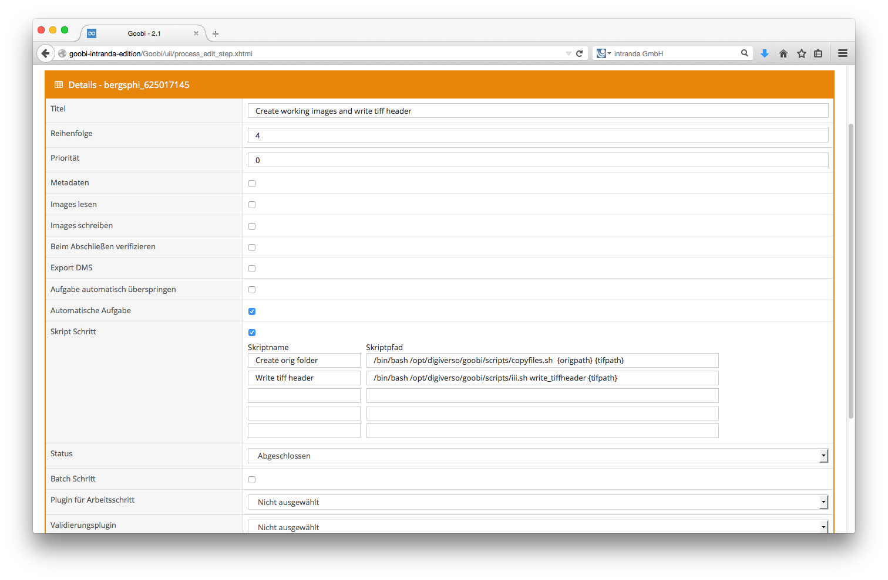

# 6.5.1. Beispielkombination für einen automatischen Skript Schritt

In den meisten Fällen wird ein automatischer Schritt mit einem Skript-Schritt kombiniert. Goobi reagiert dann auf die Ausgabe des Skriptes. Wenn Meldungen auf der Standard-Ausgabekonsole ausgegeben werden, werden diese von Goobi als reine Statusmeldungen gewertet und führt die Arbeiten weiter fort. Werden von den Skripten hingegen Fehlermeldungen auf der Fehler-Ausgabekonsole ausgegeben, erkennt Goobi dieses als Fehler und unterbricht die weitere Verarbeitung des Workflows.



Ein Beispiel für die Kombination eines automatischen Workflowschritts mit einem Skript-Schritt ist die Konvertierung von Bildern zu `TIFF/JPEG`. Goobi ruft automatisch ein Skript auf und konvertiert die Bilder in dem angegeben Ordner in das Format `TIFF/JPEG`:

In dem folgenden Beispiel wird das Skript des intranda image improvers aufgerufen:

```bash
/opt/digiverso/goobi/scripts/iii.sh
```

Ihm werden zwei Parameter übergeben. Der eine Parameter convert\_images ist im Skript selbst definiert. Der Parameter {tifpath} wird von Goobi dynamisch mit dem Pfad zu dem Ordner ersetzt, innerhalb dessen sich das Imageset befindet.


Parameter können mit Anführungszeichen \(`"`\) zusammengefasst werden, damit sie als ein Argument an den aufgerufenen Prozess durchgereicht werden. Wenn ein Anführungszeichen als Argument direkt an den neuen Prozess durchgereicht werden soll, muss es mit einem vorangeführten zweiten Anführungszeichen \(dann also: `""`\) escaped werden.


