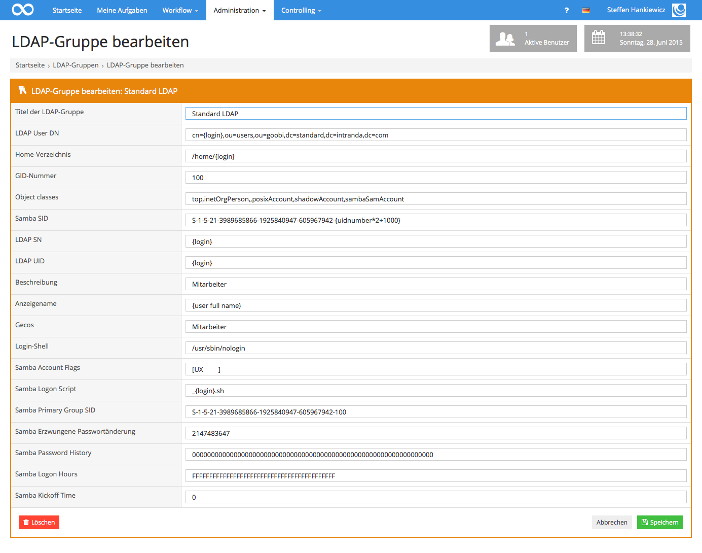

# 3.3. Authentifizierung der Nutzer mittels LDAP

## **Allgemeines**

Goobi verwendet in der Regel einen LDAP Server zur Authentifizierung der Benutzer. Hierdurch ist es möglich sich mit demselben Benutzernamen und Passwort wie in Goobi auch mit dem bereitgestellten Netzlaufwerk zu verbinden. Die Konfiguration der LDAP Anbindung erfolgt in der Goobi Konfigurationsdatei `goobi_config.properties`. Weiterhin werden LDAP-Gruppen im Adminstrationsbereich von Goobi eingerichtet.

Der LDAP Server sollte über die Schemata `COSINE`, `inetOrgPerson`, `NIS` und `SAMBA` verfügen.

## **Konfiguration in der Datei goobi\_config.properties**

In der Datei `goobi_config.properties` stehen die folgenden Konfigurationseinstellungen zur Verfügung:

_**Auflistung der Parameter für die Konfiguration des Zugriffs auf den LDAP-Server**_

| **Option** | **Bedeutung** |
| :--- | :--- |
| `ldap_use`   |  Verwendung eines LDAP Servers \(true/false\)  |
| `ldap_use`   |  CA Zertifikat für SSL Verbindungen  |
| `ldap_cert_pdc`   |  Server Zertifikat für SSL Verbindungen  |
| `ldap_cert_pdc`   |  Pfad zu dem zu verwendenden Keystores  |
| `ldap_keystore_password`  |  Passwort des Keystores  |
| `ldap_url`   |  URL des LDAP Servers  |
| `ldap_readonly`   |  Zugriff auf LDAP nur lesend \(true/false\)  |
| `ldap_encryption`   |  Verschlüsselungsart für Passwörter \(SHA/MD5\)  |
| `ldap_useTLS`   |  Verschlüsselung der LDAP-Verbindung mittels TLS  |
| `ldap_sslconnection`  |  Verschlüsselung der LDAP-Verbindung mittels SSL  |
| `ldap_nextFreeUnixId`  |  LDAP Attribut mit Angabe der nächsten freien UNIX Nutzer ID  |
| `ldap_adminLogin`   |  DN für den LDAP Zugriff  |
| `ldap_adminPassword`   |  Passwort für den LDAP Zugriff  |
| `ldap_readDirectoryAnonymous`  |  Anonymer Zugriff auf das LDAP  |

Die Konfiguration innerhalb der Konfigurationsdatei `goobi_config.properties` bei Verwendung eines lokalen LDAP Servers sieht beispielhaft wie folgt aus:

```text
# -----------------------------------
# LDAP Configuration
# -----------------------------------

# Logins ueber LDAP verwenden
ldap_use=true

# Root-Certificate
ldap_cert_root=/opt/digiverso/goobi/scripts/cacert.crt
ldap_cert_pdc=/opt/digiverso/goobi/scripts/cert.crt

# Keystore
ldap_keystore_password=changeit
ldap_keystore=/opt/digiverso/goobi/scripts/mykeystore.ks

# Zugriffsdaten fuer LDAP (Gleichheitszeichen maskieren)
ldap_url=ldap://localhost:389/
ldap_nextFreeUnixId=cn\=NextFreeUnixId,dc\=goobi,dc\=example,dc\=net
ldap_adminLogin=cn\=Manager,dc\=goobi,dc\=example,dc\=net
ldap_adminPassword=CHANGEME
ldap_sslconnection=false

# Password encryption SHA or MD5
ldap_encryption=SHA

ldap_readonly=true
ldap_useTLS=false
```

## **Konfiguration in Goobi**

Weiterhin sind LDAP-Gruppen im Administrationsbereich von Goobi zu konfigurieren. Wesentlich ist hierbei insbesondere die korrekte Einrichtung des User DN. Hier erfolgt die Zuordnung eines Goobi-Nutzers zu einem im LDAP definierten Nutzer. Die Variable `{login}` wird in diesem Fall durch den Usernamen ersetzt, mit dem der Login erfolgt.

Beispielkonfiguration einer LDAP Gruppe in Goobi:



## **Konfiguration innerhalb des Betriebssystems**

Neben diesen Goobi-spezifischen Einstellungen ist weiterhin sicherzustellen, dass auch dem Betriebssystem die LDAP-Nutzer bekannt sind. Hierzu ist die korrekte Angabe der LDAP-Information insbesondere in den folgenden Dateien notwendig:

```bash
/etc/ldap/ldap.conf
/etc/ldap.conf
/etc/nsswitch.conf
/etc/pam.d/*
```

Die Verwendung des LDAP-Servers muss für SAMBA aktiviert sein, welches jedoch in Ubuntu 14.04. LTS standardmäßig der Fall ist.

