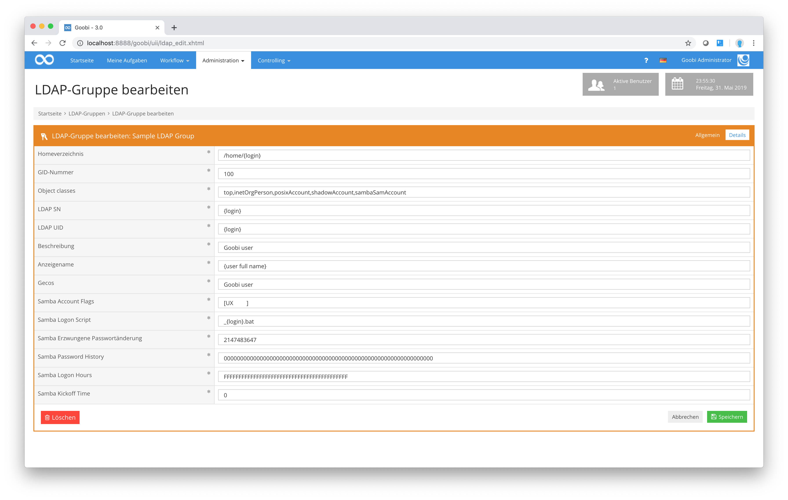

# 3.3. Authentifizierung der Nutzer mittels LDAP

## Allgemeines

Goobi verwendet in der Regel einen LDAP Server zur Authentifizierung der Benutzer. Hierdurch ist es möglich, sich mit dem selben Benutzernamen und Passwort wie in Goobi auch mit dem bereitgestellten Netzlaufwerk zu verbinden. In der Konfigurationsdatei `goobi_config.properties` wird einerseits angegeben, ob LDAP grundsätzlich von Goobi verwendet werden soll, andererseits wird dort auch der verwendete Truststore konfiguriert. Alle weiteren Einstellungen zu LDAP-Verbindungen und -Benutzergruppen werden im Administrationsbereich in der Benutzeroberfläche vorgenommen.

Der LDAP Server sollte über die Schemata `COSINE`, `inetOrgPerson`, `NIS` und `SAMBA` verfügen.

## Konfiguration in der Datei goobi\_config.properties

In der Datei `goobi_config.properties` stehen die folgenden Einstellungen für LDAP und den Truststore zur Verfügung:

| Eigenschaft | Typ | Standardwert | Beschreibung |
| ----------- | --- | ------------ | ------------ |
| `ldap_use` | Boolean | `false` | Dieser Wert gibt an, ob ein LDAP-Service verwendet werden soll. |
| `truststore` | Text |  | Dieser Wert gibt an, wo sich der Truststore befindet. |
| `truststore_password` | Text |  | Dieser Wert gibt das Passwort für die Authentifizierung im Truststore an. |

**Hinweis:** In früheren Goobi-Versionen gab es an dieser Stelle die Einstellungen `ldap_keystore` und `ldap_keystore_password`. Diese wurden umbenannt, da der Keystore auch für andere Zwecke verwendet werden kann. Diese Einstellungen werden **nicht mehr unterstützt**.

**Hinweis:** Gelegentlich tauchen in älteren Konfigurationsdateien die falsch überlieferten Einstellungen `ldap_truststore` und `ldap_truststore_password` auf. Diese Einstellungen existieren in Goobi nicht und werden entsprechend **nicht unterstützt**.

Die Konfiguration innerhalb der Konfigurationsdatei `goobi_config.properties` bei Verwendung eines lokalen LDAP Servers kann zum Beispiel wie folgt aussehen:

```text

# -----------------------------------
# ldap
# -----------------------------------

# Use LDAP server for authentication
ldap_use=true

# -----------------------------------
# truststore
# -----------------------------------

# Keystore for LDAP and other services
# There is no default value, but it can look like this example:
# /opt/digiverso/goobi/scripts/mykeystore.ks
#truststore=
#truststore_password=

#OLD configuration:
ldap_cert_root=/opt/digiverso/goobi/scripts/cacert.crt
ldap_cert_pdc=/opt/digiverso/goobi/scripts/cert.crt
# Password encryption SHA or MD5
ldap_encryption=SHA
# Zugriffsdaten fuer LDAP (Gleichheitszeichen maskieren)
ldap_nextFreeUnixId=cn\=NextFreeUnixId,dc\=goobi,dc\=example,dc\=net
ldap_adminLogin=cn\=Manager,dc\=goobi,dc\=example,dc\=net
```


## Konfiguration in Goobi

Weiterhin sind LDAP-Gruppen im Administrationsbereich von Goobi zu konfigurieren. Wesentlich ist hierbei insbesondere die korrekte Einrichtung des User DN. Hier erfolgt die Zuordnung eines Goobi-Nutzers zu einem im LDAP definierten Nutzer. Die Variable `{login}` wird in diesem Fall durch den Usernamen ersetzt, mit dem der Login erfolgt.

Beispielkonfiguration einer LDAP Gruppe in Goobi:



## Konfiguration im Betriebssystem

Neben den Goobi-spezifischen LDAP-Einstellungen ist weiterhin sicherzustellen, dass auch dem Betriebssystem die LDAP-Nutzer bekannt sind. Hierzu ist die korrekte Angabe der LDAP-Informationen insbesondere in den folgenden Dateien notwendig:

```bash
/etc/ldap/ldap.conf
/etc/ldap.conf
/etc/nsswitch.conf
/etc/pam.d/*
```

Die Verwendung des LDAP-Servers muss für SAMBA aktiviert sein. Seit Ubuntu 14.04 LTS ist dies standardmäßig voreingestellt.

