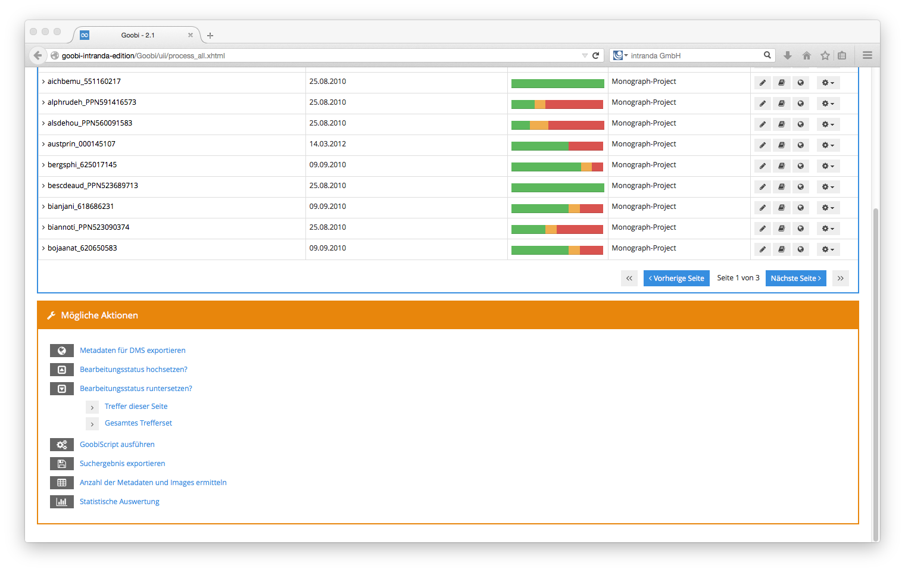

# 7.3. Aktionen für Trefferlisten

Neben den bereits beschriebenen Möglichkeiten, jeden einzelnen Band unabhängig vom aktuellen Workflowstatus zu editieren, zu ändern oder in dessen Struktur- und Metadaten zu arbeiten bzw. die Daten neu in das Präsentationssystem exportieren zu lassen, besteht ebenfalls die Möglichkeit, verschiedene Aktionen auf eine ganze Liste von Vorgängen anzuwenden. Hierbei werden sämtliche in der Tabelle angezeigten Vorgänge für diese Aktionen berücksichtigt.

Möchten Sie eine Änderung oder Aktion ausschließlich an einer bestimmten Auswahl von Vorgängen vornehmen, so filtern Sie die Vorgänge. Filtern Sie hierfür über das Eingabefeld `Vorgänge filtern` oder der Liste der vordefinierten Filter bzw. mit der Suchfunktion von Goobi diejenigen Vorgänge, die Sie gemeinsam bearbeiten möchten.

Nachdem Sie die Trefferliste an Ihre Bedürfnisse angepasst haben, können Sie nun unterhalb der Vorgangstabelle die bereitgestellten Aktionen auf dieses Trefferset anwenden. Für jede einzelne Aktion lässt sich darüber hinaus auswählen, ob die Aktion für das gesamte Trefferset, also alle gefilterten Vorgänge, oder nur auf die aktuell angezeigte Tabellenseite angewendet werden soll. Die Auswahl der zu ändernden Vorgänge wird Ihnen in dem Moment angeboten, in dem Sie auf eine der möglichen Aktionen klicken.

Folgende Aktionen sind möglich:

_**Mögliche Massenaktionen für Vorgänge**_

| **Icon** | **Beschreibung der Aktion** |
| :--- | :--- |
|  | **Metadaten in das Document Management System \(DMS\) exportieren:** Klicken Sie auf diese Aktion, wenn Sie die gefilterten Vorgänge in das Präsentationssystem exportieren möchten. Bitte beachten Sie hierbei, dass dieser Export aufgrund der enormen Datenmengen, die Ihre Auswahl beinhalten kann, durchaus länger dauern kann. Der Export in das Präsentationssystem kopiert sowohl die Images als auch die METS-Datei an den für das Projekt konfigurierten Zielort. |
|  | **Bearbeitungsstatus hochsetzen:** Wählen Sie diese Aktion, um den Workflow mehrerer Vorgänge gemeinsam in ihrem Status zu verändern. Jeder Klick auf diese Aktion wird den Status eines jeden Vorgangs in dem aktuellen Arbeitsschritt um eine Stufe hochsetzen. Arbeitsschritte, die beispielsweise gerade im Status `In Bearbeitung` sind, werden durch den Klick auf den Status `Abgeschlossen` gesetzt und die nachfolgenden Arbeitsschritte von dem Status `gesperrt` auf `offen` gesetzt. Jeder Klick auf diese Aktion ändert den Workflow bezüglich seines Fortschritts also um jeweils einen kleinen Schritt. |
|  | **Bearbeitungsstatus runtersetzten:** Ähnlich wie die zuvor beschriebene Aktion des Hochsetzens des Bearbeitungsstatus ändert auch diese Aktion den Workflow. Hierbei wird der Bearbeitungsstatus der einzelnen Arbeitsschritte jeweils um einen kleinen Schritt herunter gesetzt und somit bezüglich seiner vorherigen Durchführung wieder rückgängig gemacht. Auf diese Weise lassen sich viele Vorgänge gemeinsam in ihrem Status editieren. |
|  | **GoobiScript ausführen:** Klicken Sie auf die Aktion GoobiScript `ausführen` und Sie erhalten eine Liste verschiedener Skripte, die sich auf das Trefferset anwenden lassen. Detailliert wird auf die möglichen GoobiScripts in [Abschnitt GoobiScript](7.4.md) eingegangen. |
|  | **Suchergebnis exportieren:** Diese Aktion öffnet einen weiteren Bereich, innerhalb dessen das Ergebnis einer Suchanfrage zusammen mit der Suchanfrage selbst gespeichert werden kann. Dabei kann individuell festgelegt werden, welche Informationen in das Ergebnis übernommen werden sollen.Das Ergebnis kann als Excel-Datei, Word- oder Richtext-Dokument oder als PDF gespeichert werden. Die dabei zur Verfügung stehenden Spalten können individuell innerhalb der zentralen Goobi-Konfigurationsdatei festgelegt werden. |
|  | **Anzahl der Metadaten und Images ermitteln:** Klicken Sie auf diese Aktion, um durch Goobi ermitteln zu lassen, wie viele Strukturdaten, Metadaten sowie Images für die gefilterten Bände im System bereits vorliegen. Sie erhalten hiermit eine Auflistung, die sowohl in grafischer als auch numerischer Form aufzeigt, welche einzelnen Vorgänge welchen Umfang haben. Darüber hinaus enthält diese Auflistung eine zusammenfassende Tabelle, in der Durchschnittswerte und Gesamtzahlen ersichtlich sind. |
|  | **Statistische Auswertung:** Klicken Sie auf diese Aktion, um verschiedene statistische Analysen auf Basis der gefilterten Vorgänge in Goobi generieren zu lassen. Sie haben hierbei die Auswahl aus sehr verschiedenen Statistiken. |

