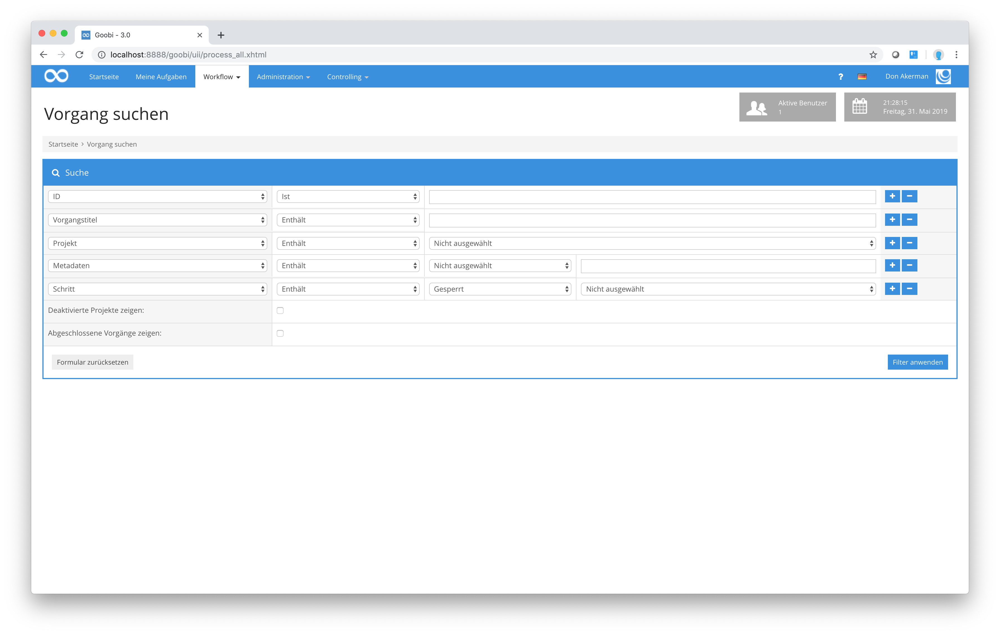

# 2.10. Nach einem Vorgang suchen

Möchten Sie nach einem Vorgang suchen, so bietet Ihnen Goobi hierfür eine einfache Suchmaske an. Diese erreichen Sie, indem Sie in der Menüleiste auf den Menüpunkt `Workflow - Vorgang suchen` klicken.

Die Eingabemaske für die Suche nach einem Vorgang in Goobi ermöglicht die freie Kombination beliebiger Suchparameter. Beim initialen Öffnen der Eingabemaske werden dabei bereits die Felder für die häufigsten Suchkriterien angeboten. 


Jede Zeile innerhalb des Suchformulars besteht jeweils aus mehreren Feldern. Im ersten Feld kann das zu durchsuchende Feld festgelegt werden. Die weiteren Felder beziehen sich jeweils auf den Wert, der innerhalb des zu durchsuchenden Feldes vorkommt. Einzelne Felder wie `Vorgangstitel` oder `ID` erlauben eine freie Eingabe von Daten. Andere Felder hingegen, wie beispielsweise die Felder `Projekt` und `Schritt`, stellen eine individuelle Liste von denjenigen Feldinhalten zur Auswahl, die tatsächlich Verwendung finden. 


Sofern die standardmäßig angebotene Anzahl an Zeilen zur Kombination von komplexen Suchanfragen nicht ausreichen sollte, können jederzeit weitere Zeilen hinzugefügt oder auch wieder entfernt werden.

