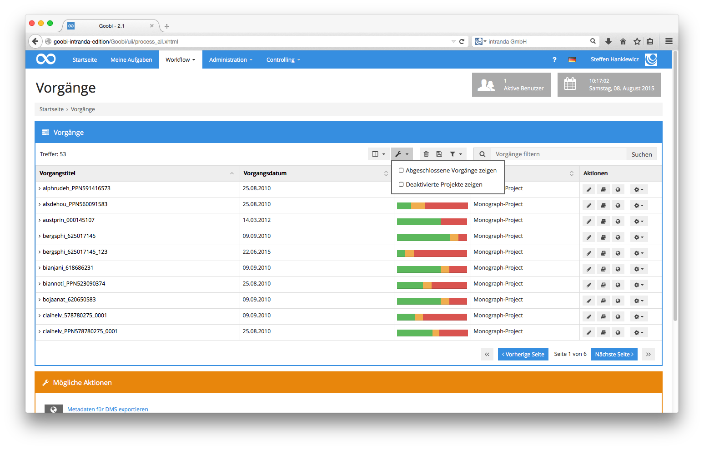
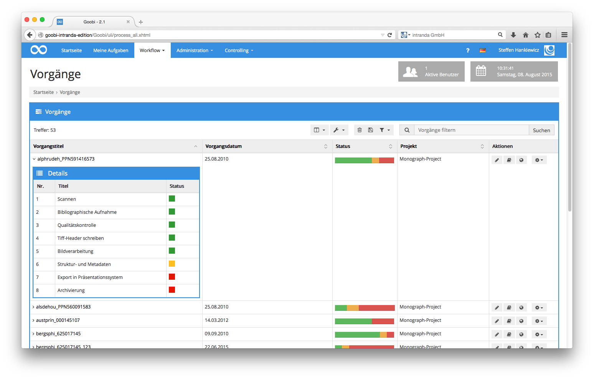

# 2.9. Vorgänge

Sämtliche in Goobi vorhandenen Vorgänge, die durch Sie persönlich oder andere Benutzer in der Vergangenheit erstellt wurden, bleiben in der Datenbank von Goobi erhalten. Um einen Überblick über diese Vorgänge in Goobi aufzulisten, öffnen Sie über die Menüleiste den Menüpunkt `Workflow - Vorgänge`.


In der Auflistung der Vorgänge erhalten Sie in tabellarischer Darstellung diejenigen Vorgänge aufgeführt, auf die Sie einen Zugriff haben. Dieser Zugriff hängt davon ab, ob sie Mitglied in einem Projekt sind und ob Sie gegebenenfalls über administrative Rechte in Goobi verfügen. Abhängig von diesen beiden Merkmalen Ihres Nutzerkontos erscheint in Goobi in den aktuellen Vorgängen gegebenenfalls nur ein Teil sämtlicher gespeicherter Daten. Vorgänge von Projekten, bei denen Sie nicht Mitglied sind, werden Ihnen nicht aufgelistet. Vorgänge in Projekten, die durch einen Administrator als abgeschlossen markiert wurden, werden ebenfalls nicht aufgeführt, wenn Sie selbst über keine administrativen Rechte in Goobi verfügen.

In der Auflistung der Vorgänge erhalten Sie einen Überblick über all diejenigen Vorgänge, die bisher noch nicht sämtliche zugehörigen Arbeitsschritte durchlaufen haben. Möchten Sie neben diesen noch aktiven Vorgängen auch diejenigen auflisten, die bereits alle Arbeitsschritte durchlaufen haben, so öffnen Sie im Tabellenmenü den Menüpunkt `Anzeige anpassen` und wählen dort die Checkbox `Abgeschlossene Vorgänge` zeigen. Dadurch erhalten Sie all diejenigen Vorgänge aus Goobi aufgelistet, auf die Sie Zugriff haben - unabhängig davon, in welchem Status sich die Vorgänge gerade befinden. Verfügen Sie über administrative Rechte, so haben Sie an dieser Stelle außerdem die Möglichkeit, durch einen Klick auf die Checkbox `Deaktivierte Projekte` zeigen auch die Vorgänge aufzulisten, deren Projekt bereits als abgeschlossen markiert wurde.


Die Übersicht der aktuellen Vorgänge erlaubt Ihnen unabhängig vom Workflow gezielt mit einzelnen Vorgängen zu arbeiten und deren Daten oder auch den Status einzelner Arbeitsschritte zu verändern. Dazu müssen Sie selbst kein Mitglied einer Benutzergruppe sein, die für einzelne Arbeitsschritte in dem Workflow der aufgelisteten Vorgänge als verantwortliche Benutzergruppe eingetragen ist. Sie erhalten auf diesem Weg beispielsweise Zugriff auf den in Goobi integrierten METS-Editor unabhängig davon, ob sich der aktuelle Vorgang in dem Bearbeitungsstatus für die Erfassung von Struktur- und Metadaten befindet. Auch ein Export in andere Systeme, wie beispielsweise ein Präsentationssystem für Digitalisate \(z.B. der Goobi viewer\), kann von dieser Oberfläche aus durchgeführt werden. Ebenso ist z.B. auch die Generierung von PDF-Dateien aus den Digitalisaten in Kombination mit den erfassten Struktur- und Metadaten möglich.

Sämtliche Spalten der Vorgangsansicht sind auf- und absteigend sortierbar. Klicken Sie hierfür auf den Spaltentitel. Die kleinen Sortiersymbole rechts in der Spalte der Spaltenüberschriften ändern sich dementsprechend.

Die Spalte `Vorgangstitel` beinhaltet den eindeutigen Bezeichner eines jeden Vorgangs. Dieser wird automatisch aus den Metadaten gebildet, wenn neue Vorgänge in Goobi hinzugefügt werden.

Die Spalte `Status` erlaubt, auf einen ersten Blick Einsicht in den aktuellen Fortschrittsstatus einzelner Vorgänge zu nehmen. Die hier verwendeten Farben zeigen, wie viele Arbeitsschritte innerhalb des Workflows bereits durch die beteiligten Benutzer in Goobi abgeschlossen wurden. Der rote Bereich des Balkens zeigt an, wie viele der Arbeitsschritte noch gesperrt sind und durch Benutzer derzeitig nicht bearbeitet werden können. Der gelbe Bereich zeigt, wie viele Arbeitsschritte sich gerade in Bearbeitung befinden oder darauf warten, dass ein Benutzer diese bearbeitet. Möchten Sie Details zum Status der Arbeitsschritte des Vorgangs erhalten, klicken Sie einfach auf einen gewünschten Vorgang in der Spalte `Vorgangstitel`. Sie erhalten somit eine detaillierte Auflistung sämtlicher Arbeitsschritte des Vorgangs mit deren jeweiligen Bearbeitungsstatus.


Am vorliegenden Beispiel ist erkennbar, welche einzelnen Arbeitsschritte des Workflows bereits durch die Benutzer abgeschlossen wurden, welcher Arbeitsschritt sich gerade in Bearbeitung befindet und welche Arbeitsschritte noch gesperrt sind, bis die vorherigen Arbeitsschritte abgeschlossen werden. Möchten Sie in der Liste der aktuellen Vorgänge gezielt einen oder mehrere Vorgänge finden, so haben Sie über das Eingabefeld `Vorgänge filtern` dazu jederzeit die Möglichkeit. Finden Sie Ihre Vorgänge hierfür einfach unter Verwendung der definierten Filtersyntax, die im [Abschnitt Vorgänge filtern](../../manager/7/7.1.md) detailliert beschrieben ist.

Eine ausführliche Beschreibung sämtlicher Funktionen, die innerhalb der Vorgangsauflistung durch Goobi bereitgestellt werden, befindet sich im [Abschnitt Goobi Management](../../manager/1.md). Dort wird im Detail auf sämtliche hier erwähnten Funktionen sowie alle weiteren Möglichkeiten eingegangen.

