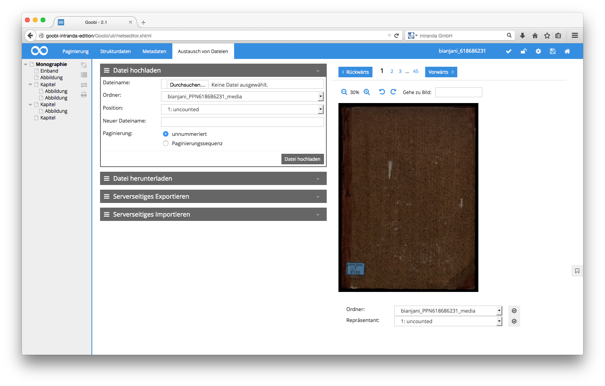

# 4.3.2. Datei hochladen

Mit dieser Funktion kann eine Datei vom Computer des Nutzers in einen gewählten Ordner des Vorgangs hochgeladen werden.

Dazu muss der Nutzer eine Datei angeben und auswählen, an welche Stelle innerhalb der Paginierungssequenz die neue Datei eingefügt werden soll. Anschließend kann gewählt werden, ob diese neue Datei als `uncounted` eingefügt werden soll oder ob sie in die bestehende Paginierung integriert wird. Mit `Datei hochladen` wird die Datei in den aktuell ausgewählten Ordner des Vorgangs eingefügt. Wenn dieser aktuelle Order der media-Ordner ist, wird ebenfalls die Paginierungssequenz aktualisiert. Dabei wird die Datei an der ausgewählten Stelle eingefügt und entsprechend entweder als unnummeriert angelegt oder in die bestehende Paginierung integriert. Wenn die Datei integriert wird, wird die Zählung für nachfolgende Seiten um eins erhöht. Zu beachten ist in diesem Zusammenhang allerdings, dass die jeweils letzte Datei innerhalb der Paginierung keine Paginierung vergeben bekommt. Stattdessen ist diese letzte Datei nicht paginiert und muss in der Paginierung gegebenenfalls noch einmal gesondert geändert werden.

Existiert im ausgewählten Ordner bereits eine Datei mit dem gleichen Namen wie die Datei, die hochgeladen werden soll, kann die Datei nicht hochgeladen werden und dem Nutzer wird eine Fehlermeldung angezeigt.

