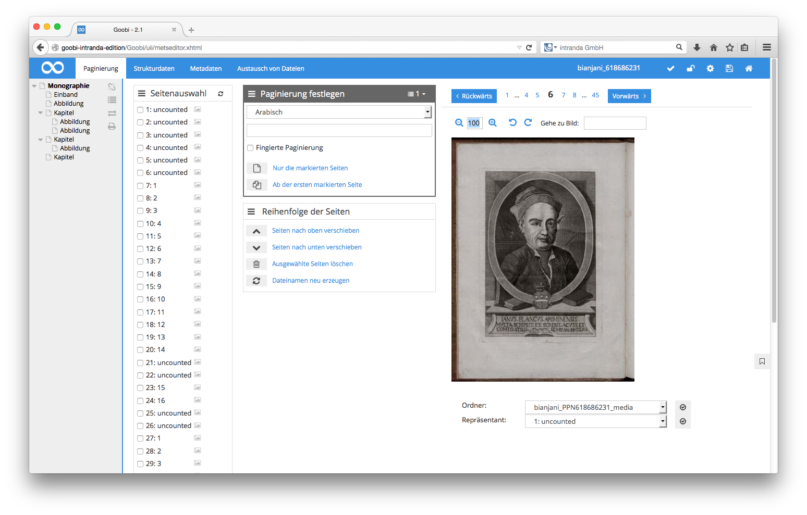
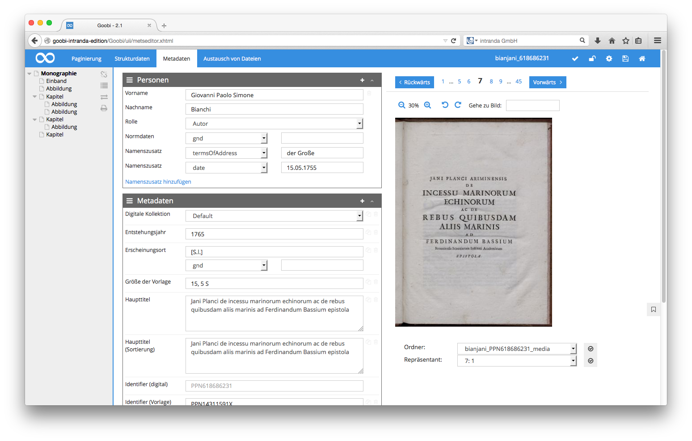

# 4.3.1.2. Seitenanzeige

Im rechten Bereich des Metadateneditors erhalten Sie einen Überblick über die einzelnen digitalen Aufnahmen des aktuellen Vorgangs. Sie erhalten auf einem Blick eine Übersicht über die Anzahl der Seiten, die aktuelle Vergrößerungsstufe, die derzeitig angezeigte Bildnummer sowie eine Information darüber, welches Derivat der bereitstehenden Digitalisate Sie gerade betrachten.

## Seitennavigation

Im oberen Bereich der Bildanzeige können Sie zwischen den einzelnen Seiten mit den Links `Vorwärts` und `Rückwärts` blättern. Auch auf die benachbarten Bilder des aktuell angezeigten lässt sich schnell zugreifen. Es ist jederzeit die erste und letzte Seite direkt auswählbar.

Die aktuelle Seite wird in der Mitte angezeigt, jeweils umgeben mit den nächsten und vorherigen zwei Seiten, sofern diese gerade anzeigbar sind. Ein Klick auf eine dieser Seitenzahlen führt Sie direkt zu dem gewählten Digitalisat. Möchten sie zwischen den Bildern navigieren ohne wiederholt auf Vorwärts, Rückwärts oder die Seitennummern zu klicken, bietet Goobi Ihnen außerdem die Möglichkeit, sich mit einfachen Tastenkombination zwischen den Bildern zu bewegen. Drücken Sie dazu einfach folgende Tastenkombinationen:

_**Tastenkombinationen für die Navigation zwischen den Bildern im Metadateneditor**_

| **Tastenkombination** | Beschreibung der Funktion |
| :--- | :--- |
| `Strg` + `Shift` + `Cursor links` | zum vorherigen Bild wechseln |
| `Strg` + `Shift` + `Cursor rechts` | zum nächsten Bild wechseln |
| `Strg` + `Shift` + `Cursor oben` | 20 Seiten vorwärts springen |
| `Strg` + `Shift` + `Cursor unten` | 20 Seiten rückwärts springen |
| `Strg` + `Shift` + `Pos 1` | auf das erste Bild springen |
| `Strg` + `Shift` + `Ende` | auf das letzte Bild springen |

Mit Hilfe dieser Tastenkombinationen ist es Ihnen jederzeit möglich, einfach und schnell selbst zwischen sehr großen Seitenbereichen zu wechseln. Neben der Navigationsleiste und den Tastenkombination bietet Ihnen Goobi direkt neben der Navigationsleiste unterhalb der Bildernavigation ebenfalls die Möglichkeit, gezielt auf ein bestimmtes Bild zu wechseln. Geben Sie dafür einfach in das Textfeld `Gehe zu Bild` die gewünschte Bildnummer ein und drücken Sie die Eingabetaste. Anschließend wechselt Goobi automatisch auf die gewählte Seite.

## Zoom

Neben den Möglichkeiten mittels der Navigationsleiste, der Tastenkombinationen und der direkten Eingabe zwischen den einzelnen Bildern zu wechseln, können Sie mit Goobi außerdem die Bilddarstellung Ihren Wünschen anpassen. Klicken Sie einfach auf die beiden Lupensymbole unterhalb der Bildernavigationsleiste, um die Anzeige des aktuellen Bildes zu vergrößern oder zu verkleinern. Zwischen den beiden Lupensymbolen zeigt Ihnen Goobi die aktuelle Zoomstufe der Darstellung an. Möchten Sie gezielt eine bestimmte Vergrößerungsstufe wählen, klicken Sie einfach zwischen die beiden Lupensymbole. Geben Sie hier den gewünschten Wert für die Zoomstufe ein und bestätigen Sie anschließend Ihre Eingabe mittels der Eingabetaste, um die gewünschte Zoomstufe zu übernehmen.

| Icon | Beschreibung |
| :--- | :--- |
|  | Eingabe der Zoomstufe per Tastatur |



## Rotation

Enthält das aktuelle Bild vielleicht Informationen, die sich nur im Querformat lesen lassen, so bietet Ihnen Goobi die Möglichkeit, das Bild in 90-Grad-Schritten zu rotieren. Klicken Sie hierfür einfach auf den nach rechts zeigenden Pfeil, um das Bild mit dem Uhrzeigersinn zu drehen und auf den nach links zeigenden Pfeil, um das Bild entgegengesetzt des Uhrzeigersinns zu drehen.

| Icon | Beschreibung |
| :--- | :--- |
|  | Rotation des angezeigten Bildes um jeweils 90 Grad nach links oder rechts |

## Auswahl des Bildordners

Unterhalb der Bildanzeige bietet Goobi Ihnen die Möglichkeit, zwischen unterschiedlichen Bildderivaten zu wählen, sofern diese vorhanden sind. In der Auswahlliste Ordner listet Ihnen Goobi alle Bildverzeichnisse zu dem aktuell gewählten Vorgang aus. Verfügen Sie beispielsweise zu einem Vorgang jeweils über mehrere Bildderivate, z.B. für die Masterimages und skalierte bzw. komprimierte Fassungen von Bildern oder Derivate mit einer anderer Farbtiefe \(z.B. bitonale Aufnahmen\), so können Sie zwischen diesen Derivaten jeweils einfach durch Auswahl des gewünschten Ordners wechseln.

## Setzen von Repräsentanten

Innerhalb des METS-Editors kann ein Bild als Repräsentant des Objektes ausgezeichnet werden. Der Repräsentant ist ein Bild, durch den das Werk repräsentiert wird. Üblicherweise ist dies das Titelblatt. Die meisten Digitalisierungsportale wie die Europeana, ZVDD, VD18 oder auch der Goobi viewer nutzen das erste Bild der METS-Datei als Repräsentant des Objektes, es sei denn, es wird explizit ein anderen Bild als Repräsentant definiert.



Um den Repräsentanten festzulegen, wählt der Nutzer hierfür zunächst das gewünschte Bild aus der bereitgestellten Liste aus. Ein anschließender Klick auf das zugehörige Icon definiert anschließend dieses Bild als Repräsentanten. Innerhalb der METS Datei wird somit das ausgewählte Bild durch das Attribut USE=“banner“ ausgezeichnet.

```markup
<mets:file ID="FILE_0002_PRESENTATION" MIMETYPE="image/tiff" USE="banner">
     <mets:FLocat LOCTYPE="URL"     
     xlink:href="file:///opt/digiverso/viewer/media/BV041228853/00000003.tif"/>
</mets:file>
```

