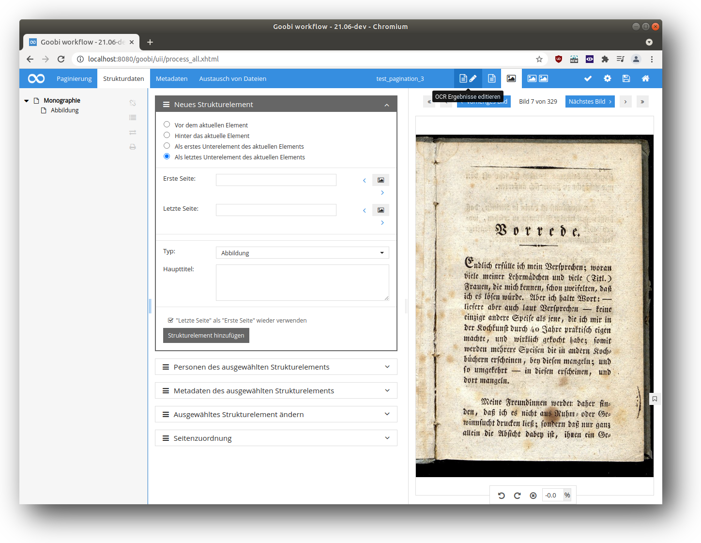
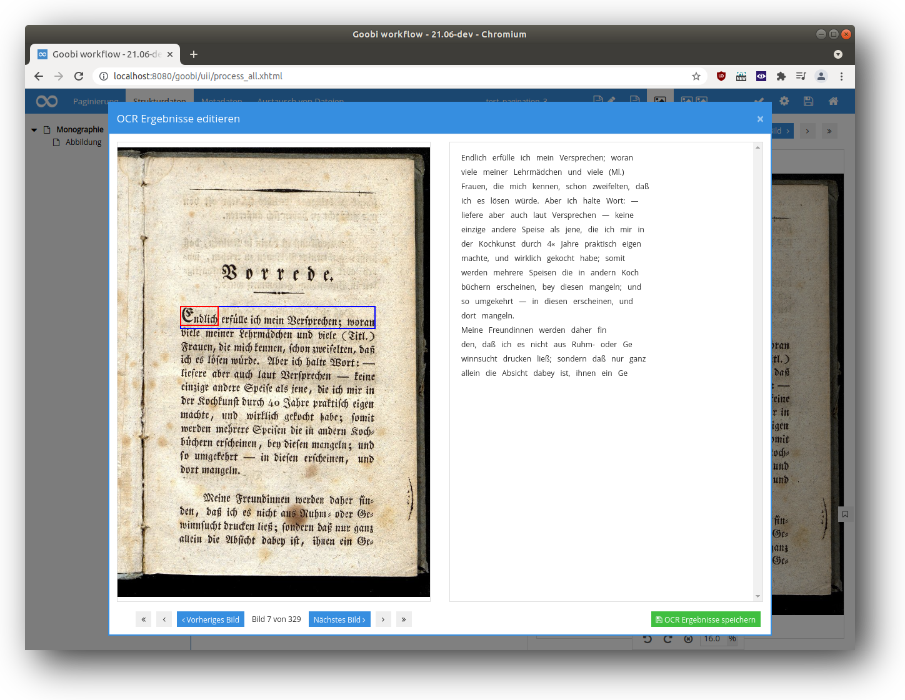

# 4.4. OCR Ergebnisse bearbeiten

Der Metadateneditor verfügt über einen Editor für OCR-Ergebnisse, mit dem die im Vorgang liegenden ALTO XML Dateien editiert werden können. Dieser Editor kann über einen Button in der oberen Menüleiste betreten werden:

Der ALTO-Editor legt sich über die übliche Oberfläche des Metadateneditors. Die Oberfläche besteht aus zwei wesentlichen Elementen. Links wird das Digitalisat angezeigt und rechts der automatisch erkannte OCR Text. Wenn man mit der Maus über das Bild oder über den Text rechts fährt, werden im Bild die erkannte Zeile und das erkannte Wort hervorgehoben:

Der Editor erlaubt es, die von der OCR erkannten Wörter zu korrigieren. Dazu kann einfach in den Text rechts geklickt und die Wörter wie von Texteditoren gewohnt verändert werden. Wenn sie ein Wort editieren, wird es gleichtzeitig auch links auf dem Digitalisat markiert. Wenn ein Wort schlecht lesbar ist, kann in der Bildanzeige mit dem Mausrad gezoomt werden.  
Außerdem kann über die Navigation unter dem Bild die zu bearbeitende Seite gewählt werden.

Um die Ergebnisse zu speichern, muss nur der grüne Button unten rechts geklickt werden. Um alle Änderungen rückgängig zu machen, kann der Editor einfach geschlossen werden.

